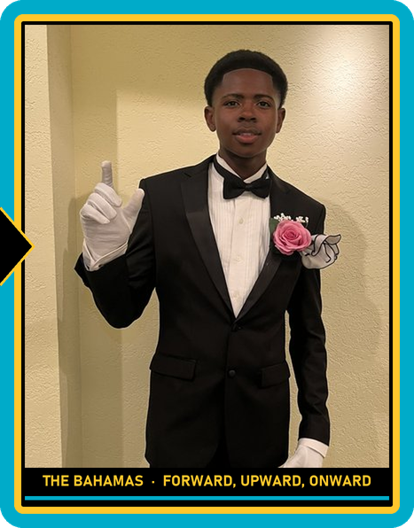

# Hi, I'm Brandon Dathan Rolle 👋

### Aspiring Automation & Robotics Engineer · Electronics Engineering Student · HVAC Apprentice · Martial Artist

I'm a 17-year-old builder from **Freeport, Grand Bahama** working toward a career in **automation and robotics engineering**. I want to become a true polymath: someone equally at home with circuits, code, mechanical systems, and the mat.

🎓 **My goal:** earn a [**Bachelor of Engineering (Automation and Robotics)**](https://www.algonquincollege.com/sat/program/bachelor-of-automation-and-robotics/) at my dream school, **Algonquin College in Ottawa, Canada**, then use those skills to help build up **The Bahamas** and to help wherever, and whoever, needs it.

🤝 **Open to** scholarships, mentorship, and internship opportunities that can help me get there.

This profile is where I document what I build along the way, from software tools and AI workflows to electronics, robotics, and physical infrastructure.

 

---

## ⚡ What I'm doing now

- 🎓 **Studying** for an Associate of Applied Science in **Electronics Engineering** at **BTVI** (Bahamas Technical & Vocational Institute)
- ❄️ **Working** as an **HVAC Apprentice** with the regional refrigeration and HVAC team in Freeport, getting hands-on with real-world mechanical and electrical systems
- 🤖 **Learning** the fundamentals of **AI/ML engineering**, and already putting AI to work by automating my own development workflow
- 🥋 **Training & coaching**: mixed martial artist in **Boxing, Brazilian Jiu-Jitsu, and Judo**, and a part-time **BJJ coach**

## 🎯 Focus areas

| Area | What that means for me |
|---|---|
| 🤖 **Automation & Robotics** | Control systems, sensors, actuators: making machines do useful work on their own |
| 🔌 **Electronics** | Circuit design, troubleshooting, and embedded hardware |
| 🏗️ **Physical Infrastructure** | HVAC, refrigeration, and the systems that keep buildings running |
| 🧠 **AI / ML** | Building the foundations, and using AI agents to automate real workflows |
| 💻 **Software** | Python tools, web apps, and developer automation |

## 🛠️ Projects

| Project | What it is | Built with |
|---|---|---|
| 🗂️ **File Type Sorter** 🔒 private | Desktop app that scans your drives, identifies every file (including disguised programs like `invoice.pdf.exe`), and sorts them into the right Windows folders, only after you approve. Runs in the system tray and watches Downloads automatically. | Python · PySide6 |
| ⚙️ **Agency OS** 🔒 private | My personal library of AI agent skills for Claude Code: automatic code review, cleanup, test-and-fix loops, Git commit and push with secret scanning, and plain-English change summaries. | Python · Claude Code · Git |
| 🏋️ [**Gym App**](https://github.com/NoxerTheBoxer/Gym-App) | Installable web app that tells me which workout I have for the day. Works offline. **[Live demo →](https://noxertheboxer.github.io/Gym-App/)** | HTML · JavaScript · PWA |
| 🏠 [**Home Forge**](https://github.com/NoxerTheBoxer/Home-Forge) | The at-home edition of my workout planner, for training without a gym. **[Live demo →](https://noxertheboxer.github.io/Home-Forge/)** | HTML · CSS |

*More electronics and robotics builds coming as I go.* 🔧

## 🧰 Toolbox

**Hands-on:** electronics · circuit troubleshooting · HVAC & refrigeration systems

## 🥋 Off the keyboard

Martial arts taught me the same things engineering does: fundamentals first, consistent reps, and staying calm under pressure. When I'm not building, I'm training **Boxing, BJJ, and Judo**, or coaching the next group of grapplers.

---

<i>"Fundamentals first. Then build everything."</i>

